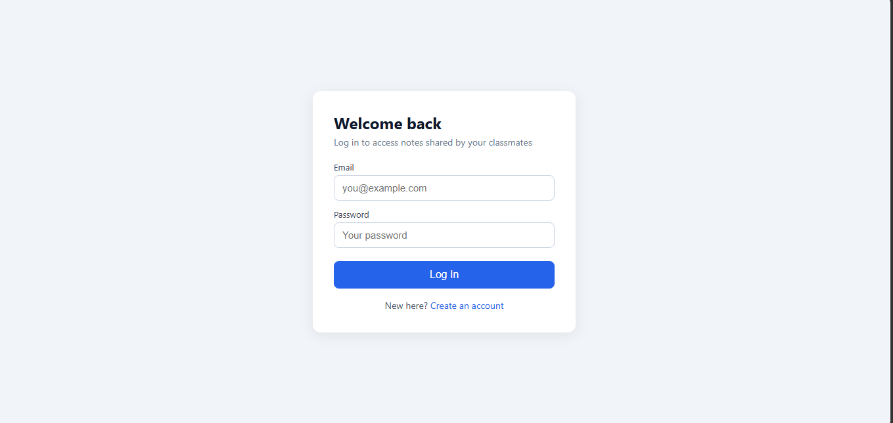
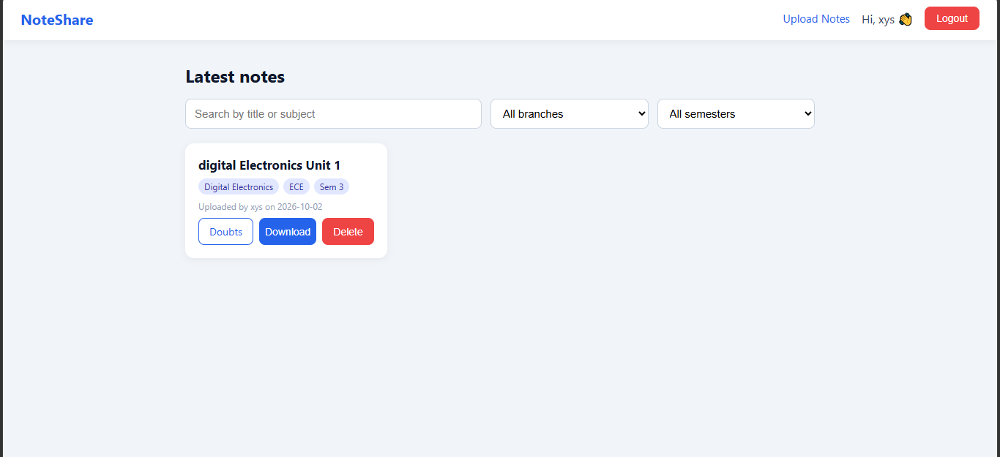
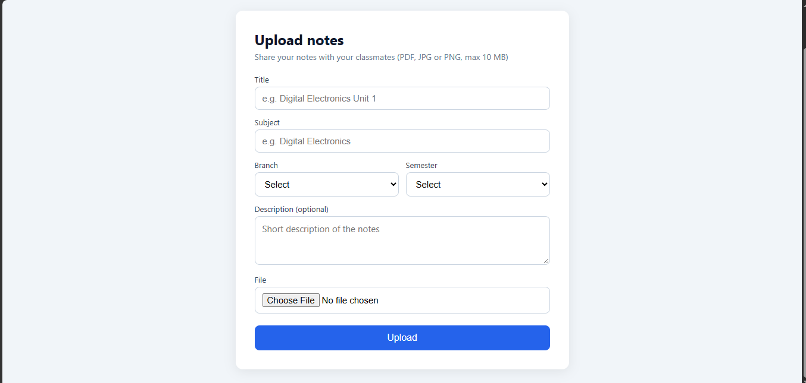
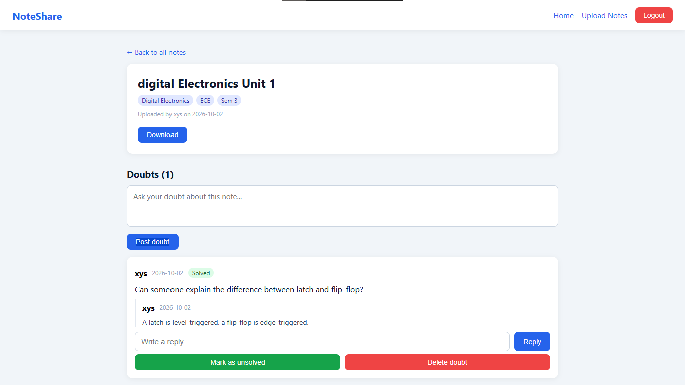

# NoteShare

A notes-sharing web app for college students. Students upload their notes, classmates log in to view and download them, and every note has its own doubts section where students can ask questions and reply to each other.

## Features

- Signup and login with password hashing (bcrypt) and JWT authentication
- Upload notes as PDF, JPG or PNG (max 10 MB)
- Browse notes with search and filters by branch and semester
- Download notes (login required)
- Delete your own notes
- Doubts section on every note: post doubts, reply, mark as solved
- Only the person who asked a doubt can mark it solved or delete it

## Tech stack

| Part | Technology |
|---|---|
| Frontend | HTML, CSS, JavaScript |
| Backend | Node.js, Express |
| Database | SQLite (better-sqlite3) |
| Auth | JWT, bcryptjs |
| File upload | Multer |

## Screenshots

| Login | Home |
|---|---|
|  |  |

| Upload | Note and doubts |
|---|---|
|  |  |

## Run locally

1. Clone the repo
```bash
   git clone https://github.com/upadhyayuday85-source/noteshare.git
   cd noteshare/backend
```
2. Install dependencies
```bash
   npm install
```
3. Create a `.env` file in the `backend` folder (see `.env.example`)
```
   PORT=5000
   JWT_SECRET=your_long_random_string
```
4. Start the server
```bash
   npm run dev
```
5. Open `frontend/login.html` with VS Code Live Server (or any static server)

## Project structure

```
noteshare/
├── backend/
│   ├── server.js
│   ├── db.js
│   ├── middleware/auth.js
│   └── routes/
│       ├── auth.js
│       ├── notes.js
│       └── doubts.js
└── frontend/
    ├── signup.html, login.html, home.html
    ├── upload.html, note.html
    ├── css/style.css
    └── js/
```

## API overview

| Method | Endpoint | Description |
|---|---|---|
| POST | /api/auth/signup | Create an account |
| POST | /api/auth/login | Log in and get a token |
| GET | /api/notes | List notes (search, branch, semester filters) |
| POST | /api/notes | Upload a note |
| DELETE | /api/notes/:id | Delete your own note |
| GET | /api/notes/:id/doubts | List doubts with replies |
| POST | /api/notes/:id/doubts | Post a doubt |
| POST | /api/doubts/:id/replies | Reply to a doubt |
| PATCH | /api/doubts/:id/solved | Mark solved or unsolved |

## Planned improvements

- Admin role to remove spam notes
- Upvotes for helpful notes
- Profile page with "My uploads"
- Cloud file storage and deployment

## Author

Uday Upadhyay
- GitHub: [upadhyayuday85-source](https://github.com/upadhyayuday85-source)
- LinkedIn: [Uday Upadhyay][def]

[def]: https://www.linkedin.com/in/uday-upadhyay-4b4bbb306